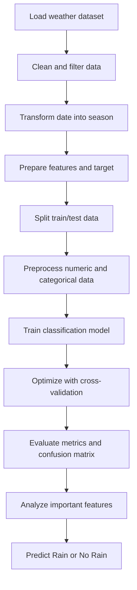

# RainOrNot

RainOrNot is a machine learning project that predicts whether it will rain based on historical Australian weather data. The project explores weather patterns, prepares the dataset, trains classification models, and evaluates their performance.

## Project Overview

This project uses the Australian weather dataset to build a model that predicts if rainfall is likely on a given day. It focuses on:

- loading and cleaning weather data
- handling missing values and categorical features
- engineering date-based seasonal information
- training multiple machine learning classifiers
- comparing model performance using validation metrics and confusion matrices

The analysis is implemented in the notebook:

- FinalProject_AUSWeather.ipynb

## Dataset

The project uses the Weather Australia dataset, which contains daily weather observations from 2008 to 2017.

Source:
- Kaggle: Weather Dataset Rattle Package

Key features include:
- temperature
- rainfall
- humidity
- wind speed and direction
- atmospheric pressure
- cloud cover
- seasonal metadata

## Technologies Used


## Project Workflow



## Requirements

Make sure you have Python 3.9+ installed.

Install the required packages:

```bash
pip install numpy pandas matplotlib seaborn scikit-learn
```

## How to Run

1. Open the project folder in Jupyter Notebook or VS Code.
2. Launch the notebook file: `FinalProject_AUSWeather.ipynb`
3. Run all cells in order.
4. Review the model summary, scores, and visual insights generated by the notebook.

## Notes

- The notebook downloads the dataset from a cloud-hosted source during execution.
- Data cleaning is performed before model training to reduce issues caused by null values and inconsistent fields.
- The project compares machine learning approaches to identify a strong predictive model for rainfall classification.

## Potential Outcome

The goal of RainOrNot is to provide a practical weather prediction example using real-world tabular data and classification models.
